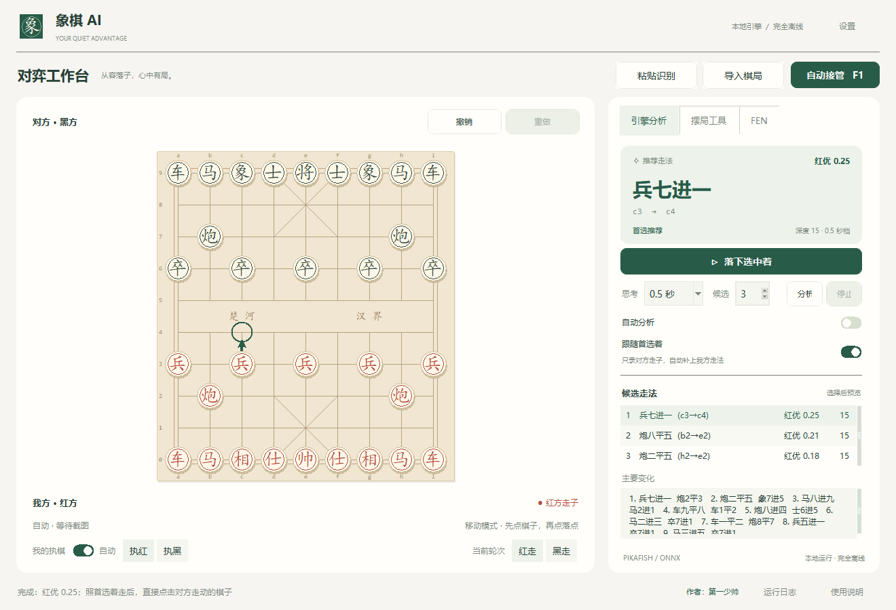

# 本地象棋 AI 助手

完全离线的 Windows 象棋分析工具，使用 Pikafish 2026-01-02 和配套 NNUE 网络。支持截图识别、棋盘编辑、自动分析、执黑视角和 `F1` 自动接管，适用于单机、复盘、学习或规则明确允许的场景。

**本地更新版本：`2026.09.04-adaptive-safety` · 自适应棋力与防送子复核 · Windows x64 单 EXE 免安装版**

通用视觉第一阶段不再假设棋盘占据整张截图或固定在左右两侧。整屏候选失败时，程序会在不同尺度上渐进搜索窗口区域，支持竖屏手机/模拟器棋盘位于 4K 或超宽桌面的任意位置；一旦锁定仍沿用坐标提示与逐像素缓存，不重复遍历整屏。定位尺寸按实际搜索区域校验，避免小棋盘被整块桌面面积错误淘汰。

标准开局增加安全自校准：只有32个占用交叉点与标准布局完全一致、且红黑方向有足够独立证据时，才按坐标恢复陌生画风的棋子类别；方向不明确时不猜。本阶段没有声称兼容未来所有视觉主题，无法定位、遮挡或低置信度时仍禁止自动点击。

自动接管的实时链路不再在每次思考后重复三次完整棋子分类。已确认轮到我方时，程序用新截图仅刷新棋盘四角和网格投影，异常才回退完整识别；圆形棋子主题还会以实际棋子圆心校正整张网格，起点点击吸附棋子圆心，终点点击吸附目标交叉点。对手的新盘面只有在能从上一盘面唯一解释为一步棋时才单帧通过，因此不靠降低棋局校验换取速度。

单步确认同时执行完整象棋规则校验，包括马腿、象眼、九宫、过河兵、炮架、将帅照面和送将。动画中若把原棋子短暂错认成另一方棋子，即使表面上仍像“一子从 A 到 B”，只要走法不合法就不会写入历史或提交引擎；程序会等待下一张稳定画面。

本版按确认的 H5 原型移植暖白 / 墨绿工作台、圆角控件、推荐走法卡片、开关及落子动效，并标注作者“第一少帅”。加入自动执棋判断，以及 F1 急停、自适应安全复核、可解释单步确认、思考并行、区域复用和快速姿态复核等接管优化；不增加浏览器运行时依赖。

## 自动判断我的执棋

- “我的执棋”旁的 **自动** 默认开启。截图导入和 F1 接管都根据原始游戏画面下方判断我方，而不是读取助手自己已经翻转过的棋盘。
- 复用现有 ONNX 识别和透视映射，将帅、将的位置映射回原图；要求双方将帅完整、位置与置信度可靠。无需另跑模型，不增加固定等待时间。
- 点击“执红 / 执黑”会转为手动模式；重新打开“自动”可恢复自动判断。识别不可靠时保留当前视角并显示待确认；自动接管未确认执棋方不会点击。
- 新对局重新判断执棋方；同局点击前如果朝向突然改变或不明确，会禁止点击并提示重新确认。
- **执棋方不是行棋方。** 自动判断不会把“我执黑”误当成“现在黑走”。标准开局始终红先；中途残局的轮次仍需核对“当前轮次”，仅凭将帅位置无法判断轮到谁走。
- 仅有 FEN 或手动摆局时没有原始屏幕朝向，不据此猜执棋方。兼容模板缺少可靠坐标映射时也不会擅自换边。
- “设置”中可切换动效、坐标、箭头、截图底图和窗口置顶。180 毫秒落子动效仅移动显示图形，不延迟棋局更新、引擎计算或实际鼠标操作；窗口隐藏接管时不运行落子动效。

自动执棋回归包含原图/反向图/缩放图识别、手动覆盖、不确定拒绝、新局换边与点击前朝向变化。可运行 `python -m unittest test_player_side test_ui`；真实 ONNX 图片检查使用 `python build_support/verify_player_side.py --image 图片路径 --expected w --output 检查报告.json`。测试和截图检查不向游戏发送鼠标点击。

[下载 XiangqiAI.exe](https://github.com/diyishaoshuai/xiangqi-ai-assistant/releases/latest/download/XiangqiAI.exe) · [最新 Release](https://github.com/diyishaoshuai/xiangqi-ai-assistant/releases/latest) · [本版更新说明](docs/releases/v2026.09.04-adaptive-safety.md) · [反馈问题](https://github.com/diyishaoshuai/xiangqi-ai-assistant/issues)

发给别人只需要 **`XiangqiAI.exe` 一个文件**，双击即可运行。无需安装、Python、另下引擎或单独复制 `_internal` 文件夹；日志和识别学习数据自动存入当前用户的数据目录，不会写到 EXE 旁边。

## 下载与运行要求

1. 打开 [Releases](https://github.com/diyishaoshuai/xiangqi-ai-assistant/releases/latest)，在 **Assets** 中下载 `XiangqiAI.exe`（约 172 MiB）。
2. 放入自己方便找到的目录，双击运行。建议用普通用户权限，不需要管理员权限。
3. 分享或换电脑时，直接复制这个 EXE；引擎、NNUE、识别模型和运行库已经内置，使用时不需要联网。

`Source code (zip)` / `Source code (tar.gz)` 是源码，不是运行版；`SHA256SUMS.txt` 仅供可选校验，不是运行依赖。旧版 ZIP 和安装包不是本版的配套文件。

- 目标系统为 Windows 10/11 64 位，本次成品验证在 Windows 11 x64 完成；不提供原生 macOS、Linux、ARM64 或 32 位构建。
- 引擎使用 x64 SSE4.1/POPCNT 版本；非常老的 CPU 若不支持这些指令，无法运行该引擎。
- 引擎默认使用最多 8 个 CPU 线程、256 MB 哈希；模型和界面还会使用额外内存。
- 启动时需要将内置组件解压到系统临时目录，可能需要数秒，并占用数百 MB 临时空间；这是单文件封装的正常行为，正常退出后自动清理。

导航：[快速开始](#快速开始) · [自动接管](#自动接管鼠标) · [数据与升级](#单文件运行日志和升级) · [常见问题](#常见问题) · [源码开发](#源码开发)

## 快速开始

1. 双击 `XiangqiAI.exe`。
2. 在游戏中截图，然后点击顶部“粘贴识别”或“导入棋局”。程序会自动还原棋子（旧版对应“粘贴并识别”或“导入并识别”）。
3. “我的执棋”默认自动，以原截图下方一侧判断红黑；也可点“执红/执黑”手动覆盖。另行核对“当前轮次：红走/黑走”。执黑时助手棋盘自动旋转，让黑方位于下方。
4. 程序会自动开始分析，不需要再点“开始分析”。
5. 棋盘绿箭头是当前候选着；在游戏中照首选着走完后，直接在助手棋盘上移动对方棋子即可。助手会自动补上你的首选着并分析下一步。
6. “窗口置顶”默认开启，助手会保持在游戏窗口上方；可在顶部“设置”中关闭。
7. 在单机或规则允许的场景，可点击“自动接管 F1”进入全自动闭环；按 `F1` 可全局启动或急停。

## 新版界面布局

`2026.08.31-smooth-ui-autoside` 使用暖白工作台、墨绿重点操作、圆角控件和暖色棋盘，统一字体、间距及操作状态，加入开关和落子动效；引擎和识别模型权重不变。



- 顶部集中放置“粘贴识别”“导入棋局”“自动接管 F1”和“设置”；底部保留运行状态、作者署名、运行日志和使用说明入口。窗口置顶、动效等选项放在“设置”中。
- 左侧棋盘随窗口大小缩放，棋子、推荐箭头、点击位置和执黑翻转使用同一套坐标；撤销/重做、执棋方与轮次始终可见。
- 右侧“引擎分析”显示推荐着法卡片、候选列表和后续推演；思考时间以秒显示，底层引擎参数不变。可双击候选、按 Enter 或点击“落下选中着”。
- “摆局工具”将红黑棋子分成两排，保留移动、橡皮擦、标准开局、残局和清空；识别底图可按需显示或隐藏。
- “FEN”集中提供导入、复制和操作说明，输入后可按 Enter 载入。三个页面支持 Ctrl+Tab 切换，小窗口中右侧可滚动，不挤掉原有功能。
- 无结果、正在分析、完成分析及不可操作按钮有明确视觉状态；更换局面后清除旧候选显示，避免旧箭头干扰。

## 自动接管鼠标

- 启动前核对当前“红走/黑走”，并让完整棋盘显示在 Windows 主屏幕上。“我的执棋”默认自动识别下方一侧；也可在启动前手动指定执红/执黑。
- 首次启动会显示一次用途确认，之后可直接按 `F1` 启停；长按只触发一次。启动后助手窗口会隐藏，先连续三帧确认棋盘并锁定所在游戏窗口。
- 屏幕抓取优先使用 DXcam 的桌面复制路径，环境不支持时自动回退 Pillow。锁定棋盘后以棋盘区域的像素变化观察动画；只有需要恢复时才重新搜索全屏，JJ、天天象棋分别使用适合其动画和结算画面的配置。
- 当前识别模型的 90×16 完整概率会拆成空位、红黑占用、具体棋子与遮挡证据。落子确认优先看起点变空、终点出现己方棋子，不再让一个被光效遮住的无关格子否决整盘。
- 每帧只与当前局面、合法一步、已发送着法、已发送着法加对手快速回复以及终局候选比较。最佳合法候选需连续胜出且与第二名拉开差距才提交；不清晰的格子按遮挡和运动程度自动降权。
- 每次复核都重新截图：只有棋盘及外圈棋子边缘的原始 RGB 像素完全相同，才复用已确认的识别结果和坐标，不使用缩略图或近似哈希。任意像素变化、截图分辨率变化都会退回 ONNX 定位和分类；优先在已确认棋盘附近定位，失败后重新搜索全屏。连续帧同时检查棋子和坐标稳定性，不降低安全置信度阈值。
- 思考结束后优先用新截图执行一次快速姿态刷新，只更新棋盘四角、透视网格和点击坐标，不再重复运行 90 格分类；位置跳变、置信度不足或窗口尺寸变化时才回退完整三帧复核。
- 识别出能唯一解释的对手走子时立即按基础预算、单主变化搜索。只有确认局面、双方走棋历史和预算全部一致，才可使用预先计算的结果；局面变化或 F1 急停会取消基础搜索和安全复核。
- 连续识别优先重新检查上次成功定位的区域，每帧仍运行新的定位模型。已锁定位置出现动画/低置信度格子时先换新截图，不连续对同一坏帧搜索全部区域；持续失败仍会恢复全屏搜索。不修改模型或降低定位、分类校验标准。
- 每次点击前都以最新姿态重新计算 9×10 交叉点。支持圆形棋子的主题会用多个已知棋子圆心经 RANSAC 校准整张透视网格；起点优先点击实际棋子圆心，终点严格点击目标交叉点中心。首次点击使用 100 毫秒两点间隔和 30 毫秒定位停顿，未生效重试回到较慢节奏。
- 用户移动鼠标或切换窗口时会自动暂停，不争抢鼠标；游戏窗口回到前台、用户空闲 1.2 秒且通过上述盘面复核后会自动恢复。
- “基础思考”设置为 0.5 秒时，自动接管先用 500 毫秒单主变化搜索。搜索深度不足、根着不稳定或 PV 暗示丢大子时自动复核到 3 秒；车炮马可能被白吃、以大换小、忽略受攻大子或局面明显不利时复核到 5 秒。静态规则只负责触发深搜，不会擅自否决深搜确认的正确弃子。
- 自动接管固定使用 `MultiPV=1`，把算力集中在最强着；“分析候选”只影响右侧人工分析。引擎结果按完整深度迭代归组，最终着法、评分、WDL 与 PV 不一致时不会直接点击。
- 遮挡、缺失将帅、低置信度、定位失败、异常盘面、落点越界或暂时无法移动光标都属于可恢复状态。3 秒后依次尝试端点、全盘、重新定位和平台终局检测；8 秒后转为低频安全观察，并持续在状态栏说明原因和等待时间，不弹模态错误窗口。
- 每次落子都是不可重复事务：起点和终点分阶段记录，终点点击一旦发送，同一事务绝不会再次点击。连续两帧确认端点即可提交；若对手已快速回复，会一次提交双方着法；绝杀提示只增强终局判断，不能单独证明点击成功。
- 对局结束后接管保持开启，不恢复助手窗口也不继续点击当前盘面；发现新的稳定合法棋盘后会清空本局历史并自动继续，自动模式下重新确认执棋方。标准开局固定红方先走，其他新残局沿用启动时设置的轮次。
- `F1` 是全局启停键：基础搜索、安全复核、等待对手和两次点击间隙都能立即急停。停机后助手窗口自动恢复并保留最后确认的局面，不再弹出多余的停止对话框。
- 每次确认双方着法和发送终点点击时，会把合法棋局历史与待确认事务原子保存到 `%LOCALAPPDATA%\XiangqiAI\autoplay-state.json`。F1 或进程重启后只有当前画面能合法衔接时才恢复；终点已发送而画面仍未变化时只观察，绝不重新点击。
- 急停由独立线程监听 Windows 热键（占用时回退后台轮询），先禁止后续点击并恢复窗口，再等待后台清理；停止期间再次按 F1 不会排队重启。后台结束后再次按 F1 才开始新会话。
- 自动接管只读取屏幕图像并模拟左键单击，不读游戏内存、不注入进程、不解析网络协议，也不会控制键盘或点击棋盘以外的位置。仅当异常持续超过 3 秒时，才会把最多 12 张棋盘区域帧和结构化状态保存在 `%LOCALAPPDATA%\XiangqiAI\diagnostics`；最多保留 5 个事件或 100 MB，从不上传，可在“设置”中一键清除。

## 自动分析

- “自动分析”默认开启。移动棋子、截图识别、撤销/重做、载入 FEN 或切换走子方后都会自动重新思考。
- 连续摆子时会等待约 0.5 秒，避免每放一枚棋子就重复启动引擎。
- 新局面会停止旧搜索，旧局面的迟到结果不会覆盖当前结果。
- “开始分析”保留用于手动重算；“停止”只停止当前搜索，下次局面变化仍会自动分析。
- 如果截图或手动局面中当前方已经能直接捕获敌方将帅，助手会绕过标准引擎搜索，优先显示“立即吃将”，避免非法轮次局面让 Pikafish 给出绕路杀法。

## 只录对方走子

- “跟随首选着（只录对方走子）”默认开启。
- 当当前局面已有有效首选着时，直接点击对方刚走动的棋子。助手会先在内部自动落下你的首选着，再让你点击对方落点。
- 录完对方走子后，助手自动切回你的回合并开始分析下一步。
- 如果你在实际游戏中没有采用软件首选着，请先关闭该选项，再手动录入双方走子。
- 如果首选着会吃掉你点击的那枚棋子，助手不会自动代走，并会提示核对局面，避免错误同步。

## 和棋、败势与循环保护

- 程序读取 Pikafish 的 WDL（胜/和/负）结果，不再把 `0.00` 错误显示成“红优”，而会明确显示“和棋”。
- 从截图/FEN 载入局面后，助手会把自动补走的己方着法和你录入的对方着法组成完整 UCI 历史交给 Pikafish；引擎不再把每个重复 FEN 都误当成第一次出现。
- 同一局面第二次出现时，助手用 UCI `searchmoves` 排除已经导致循环的根着，并以单主变化重新深搜；替代着只有仍保持胜势，或与原首选相差不超过 0.80，才会被采用。
- 当深度足够且引擎给出的获胜权重为 0，程序会弹出“建议认输”，并只暂停当前局面的自动跟随，防止在无法取胜的残局中来回循环。
- 安全暂停不会取消“跟随首选着”的勾选偏好；载入新的可胜局面后会自动恢复，避免漏补上一手推荐着。
- 即使避循环搜索仍未奏效，同一局面出现 3 次时也会暂停该局面。如果引擎仍判定必胜，程序会提示重新截图同步，不再错误建议认输；只有没有可保持胜势的路线时才建议认输重开。
- 引擎判断、最终结果和关键耗时自动写入 `%LOCALAPPDATA%\XiangqiAI\logs\xiangqi-ai.log`；高频深度输出每 250 毫秒最多记录一条，所有候选仍完整解析，避免逐行刷盘拖慢落子。当前日志达到约 2 MiB 时轮转，另保留 3 份历史日志，总量约 8 MiB；达到上限自动覆盖最旧日志，不按退出删除，无需手动导出。
- 点击窗口底部的“运行日志”即可直接查看当前日志。

## 避免无效连续将军

- 助手会记录己方连续将军次数。连续两手将军后，若当前并非 5 步内的明确短杀，会用 `searchmoves` 对非将军合法着做至少 3 秒的单主变化复核。
- 非将军替代着必须通过与原首选的评价比较；明显更差时保留引擎首选，不再从浅层 12 候选中人为换着。
- 非将军候选必须保持至少 50% 的引擎获胜权重，程序不会为了停止将军而主动丢掉胜势。
- 如果确实只有连续将军才能保持胜势，状态栏会明确说明没有找到保胜的非将军着。

## 执黑视角

- “我的执棋”与“红走/黑走”相互独立：前者决定你执哪一方以及棋盘朝向，后者只表示当前轮到谁走。
- 选择“执黑（黑在下）”后，棋子、坐标、推荐箭头、鼠标落点、截图底图和楚河汉界都会统一旋转 180°。
- 引擎内部仍使用标准 FEN 坐标，因此翻转视角不会改变分析结果或走子记录。

## 强度设置

- `分析候选 1`：人工分析时全部算力集中在最佳着。
- `分析候选 3–5`：人工分析时同时比较多种走法；自动接管始终使用单主变化，不受此项影响。
- 普通残局建议思考 3–5 秒；复杂中局建议 10–30 秒。
- 引擎默认使用最多 8 个 CPU 线程和 256 MB 哈希。

## 摆局操作

- “移动棋子”：先点棋子，再点目标交叉点。
- 棋子按钮：选中后点击棋盘交叉点即可放置。
- “橡皮”或鼠标右键：删除棋子。
- 支持撤销、重做、标准开局、空盘和 FEN。
- 坐标采用引擎坐标：红方底线为 0，黑方底线为 9。

## 截图自动识别

“粘贴识别”和“导入棋局”使用预训练 ONNX 深度模型。第一阶段自动检测棋盘四个外角并完成透视、尺寸归一化；第二阶段一次预测全部 90 个交叉点以及红黑双方十四种棋子，不依赖固定截图分辨率或固定亮度。

程序会尝试全屏、左侧棋盘区域和右侧棋盘区域，并根据模型置信度及基本象棋棋子数量规则选择最可靠的结果；内部棋局统一为红方在下的标准坐标，显示视角则按我的执棋调整。只有模型标记为遮挡或低置信度的格子才会要求确认。识别后仍建议快速核对棋盘，并确认“红走/黑走”。

深度模型、OpenCV 和 ONNX Runtime 均随程序打包，识别过程完全离线。如果状态栏显示“兼容模板”，表示深度模型没有成功加载或没有可靠定位到棋盘，此时程序会明确弹出警告。

## 单文件运行、日志和升级

程序文件与运行数据分开存放：

| 内容 | 位置 | 保留方式 |
| --- | --- | --- |
| 主程序 | 你放置的 `XiangqiAI.exe` | 手动替换即可升级 |
| 自动日志 | `%LOCALAPPDATA%\XiangqiAI\logs\xiangqi-ai.log` 及 `.1`～`.3` | 每份约 2 MiB，合计约 8 MiB 滚动保留 |
| 识别学习数据 | `%LOCALAPPDATA%\XiangqiAI\recognition_templates.json` | 随纠正学习逐步积累，升级和退出不清空 |
| 临时运行组件 | 通常为 `%TEMP%\_MEI...` | 正常退出后自动清理 |

- 只分发 `dist/XiangqiAI.exe`。引擎、NNUE、ONNX 模型、运行库、说明与许可证均嵌入 EXE；功能与原目录版一致，不需要安装程序。
- 运行时将组件解压到 Windows 的临时目录（通常为 `%TEMP%\_MEI...`），正常退出后自动回收。解压会增加启动时间，运行时临时空间仍需数百 MB；单文件不代表完全不产生临时文件。断电或整个进程树被强制结束时可能来不及清理，不会因此扫描删除其他软件的临时目录。
- EXE 所在目录不产生日志、模板或缓存，即使从只读目录运行也不要求写入该目录。
- 自动日志位于 `%LOCALAPPDATA%\XiangqiAI\logs`，约 8 MiB 滚动保留，程序内“运行日志”（旧版“打开日志”）可直接查看。不同进程写入及轮转会互斥，避免多开时争用同一日志；日志不自动上传。8 MiB 仅指日志，不包含识别学习数据和临时组件。
- 识别学习数据位于 `%LOCALAPPDATA%\XiangqiAI\recognition_templates.json`，与旧版位置相同，已有学习数据继续使用。旧备用目录 `%USERPROFILE%\.xiangqi_ai` 的模板可兼容读取。程序从不把截图保存为学习数据。
- 升级时先退出程序，再替换 EXE，用户数据无需移动。删除 EXE 仅删除程序，日志和学习数据会保留；不再使用且要移除数据时，可在退出所有副本后删除软件专属的 `%LOCALAPPDATA%\XiangqiAI` 目录，不要删除整个 AppData。
- 单文件版不创建卸载记录、桌面/开始菜单快捷方式、服务、计划任务或自启动项。Windows 自己维护的系统日志、预读取等记录不作系统级擦除。
- 原有安装版不会被单文件版自动卸载，旧安装包和 `installer/` 目录仅保留作历史维护，不再作为当前交付方式。请不要把新 EXE 放进旧版安装目录再运行旧卸载程序；旧卸载程序也会清理共用的用户数据，需要保留模板时先备份。

从安装版迁移时，先退出所有旧版和新版副本，备份 `%LOCALAPPDATA%\XiangqiAI`，再处理旧版卸载。将新 EXE 放在独立目录；如需继续使用学习数据，在旧版卸载完成后恢复 `recognition_templates.json` 即可。单 EXE 不会自动修复其他电脑上的历史卸载残留。

## 常见问题

**为什么一个 EXE 还需要临时文件？**

“单文件”指只需分发一个文件，不是完全不写磁盘。引擎和原生推理库运行时需要临时解压；自动日志与学习数据需要持久保留。程序不会在 EXE 所在目录生成这些文件。

**如何找到日志，方便排查和优化？**

点击程序中的“运行日志”（旧版“打开日志”），或在资源管理器地址栏输入 `%LOCALAPPDATA%\XiangqiAI\logs`。自动接管异常还会限量保存仅供本机排查的棋盘裁剪和状态到 `%LOCALAPPDATA%\XiangqiAI\diagnostics`。复现问题后可提交 [Issue](https://github.com/diyishaoshuai/xiangqi-ai-assistant/issues)，附上版本号、Windows 版本、操作步骤、出错时间及你主动检查过的日志/诊断内容；程序不会自动上传。

**换电脑后为什么没有之前的学习数据？**

日志和学习数据保存在每台电脑的当前 Windows 用户目录，不跟随 EXE 自动同步。需要迁移时，退出程序后额外复制 `recognition_templates.json` 到新电脑的同名数据目录；该文件不是运行必需品。

**下载后提示未知发布者或安全警告怎么办？**

本版未购买代码签名证书，可能出现未知发布者提示。请核对下载来源和 SHA-256；遇到杀毒软件明确报毒时，先停止运行并反馈检测结果，不要关闭系统防护或添加整个目录的排除项。

**如何校验下载是否完整？**

在 EXE 所在目录打开 PowerShell：

```powershell
Get-FileHash .\XiangqiAI.exe -Algorithm SHA256
```

将结果与**同一 Release** 的 `SHA256SUMS.txt` 对照。校验文件无需放在 EXE 旁，也无需随程序分发。

**启动失败、无法识别或接管没有点击怎么办？**

先确认系统为 x64、临时目录可写且有足够空间。识别时确保完整棋盘清晰可见；自动接管要求棋盘位于主屏幕、游戏窗口在前台、用户空闲，并正确选择执棋方和轮次。遮挡、切屏或盘面无法确认时会安全等待；按 `F1` 可停止。仍有问题时查看日志，不要同时运行多个接管副本。

**不再使用时怎么删除？**

退出所有副本后删除 EXE 即可移除程序。若连日志和学习数据也不要了，可另外删除软件专属的 `%LOCALAPPDATA%\XiangqiAI`；曾使用很早版本的用户可检查 `%USERPROFILE%\.xiangqi_ai`。不要删除整个 AppData 或临时目录。当前版本不创建卸载程序，也不需要运行旧版卸载器来删除它。

## 源码开发

要求 Windows、Python 3.11+（64 位）以及 Pikafish Windows 引擎和 NNUE 文件。本版使用 Python 3.12.10 和 PyInstaller 6.16.0 构建验证。

```powershell
python -m venv .venv
.\.venv\Scripts\Activate.ps1
pip install -r requirements.txt
$env:PIKAFISH_DIR = "C:\path\to\Pikafish"
python app.py
```

运行测试：

```powershell
python -m unittest discover -s . -p "test_*.py"
```

打包：

```powershell
pyinstaller --noconfirm --clean XiangqiAI.spec
```

输出仅为 `dist/XiangqiAI.exe`；不需要再编译 Inno Setup 安装包。`dist/XiangqiAI/` 若还存在，是旧目录版历史产物，不属于新 EXE 的依赖。

成品验证（不会操作真实棋盘或鼠标）：

```powershell
python build_support/verify_singlefile.py --exe dist/XiangqiAI.exe
```

验证会在 `build/singlefile-verification` 创建隔离的程序目录、用户数据和临时目录，运行内置功能自检、模型推理、接管模拟测试、日志轮转以及隐藏运行后的退出清理检查。提供 `--image` 可额外验证实际棋盘图片，报告保留在测试目录中。不要把开发自检参数当作日常启动参数使用。

界面回归测试为 `python -m unittest test_ui`；成品内置 `--ui-self-test`，不向真实桌面发送鼠标或键盘输入。`build_support/capture_ui.py` 可生成程序自身窗口的界面检查截图，不截取整个桌面；测试输出建议放在 `build/ui-review/`。

`PIKAFISH_DIR` 目录需包含 `Windows/pikafish-sse41-popcnt.exe` 和 `pikafish.nnue`。ONNX 棋盘定位与分类模型已包含在 `vision_models/`；其来源和许可证见 `vision_licenses/` 与 `THIRD_PARTY_NOTICES.md`。

自动落子延迟回放（使用真实模型/引擎，截图来自指定图片，鼠标为模拟接口，不操作桌面）：

```powershell
python build_support/benchmark_autoplay.py --image C:\path\to\board.png --output build/autoplay-speed-benchmark.json
```

回放报告包含三帧模型复核基线、五次 500 毫秒搜索、快速复核与模拟两次点击耗时，不包含真实屏幕抓取、网络或游戏响应时间。

`build_support/benchmark_pipeline.py` 用连续两张棋局图片比较串行/并行确认与搜索，要求传入 `--before`、`--after`、`--moves 己方着法 对手着法`、`--output`。它实际运行两帧模型和 500 毫秒引擎搜索，模拟截图和鼠标，不仅测试画面不变的缓存路径。

`app.py --vision-performance-probe --probe-images 图片路径...`（EXE 同样支持）在隐藏的真实界面下，用后台线程运行模型，分开记录定位、分类、候选区域数和整帧耗时，结果写入用户数据目录下的 `diagnostics/vision-performance.json`。此诊断仅读取指定图片，不抓取桌面或发送鼠标键盘操作。

发布时同步更新 `diagnostics.py` 的版本、`build_support/version_info.txt`、README 和发布说明，重新构建后运行测试。Git 仓库仅提交源码、模型和文档；将 `dist/XiangqiAI.exe` 与它的 SHA-256 校验文件作为 GitHub Release 附件发布，不再生成安装包。历史安装维护说明见 [installer/README.md](installer/README.md)。

本版验证包括全部通过的 188 项源码回归测试和 111 项单 EXE 集成断言；成品通过 15 组内置功能自检。新增完整 UCI 迭代解析、自适应 3/5 秒安全复核、`searchmoves` 受限搜索、跨进程对局恢复，以及既有的概率视觉、事务不可重复点击和诊断限额检查。接管检查使用模拟 Win32 接口，不会点击真实棋盘；这些结果不等于已在所有游戏客户端或其他电脑上验证。详细范围见[自适应棋力与防送子复核版发布说明](docs/releases/v2026.09.04-adaptive-safety.md)，旧版见[连续棋局状态跟踪版发布说明](docs/releases/v2026.09.04-state-tracker.md)、[流畅界面与自动执棋版发布说明](docs/releases/v2026.08.31-smooth-ui-autoside.md)、[界面优化版发布说明](docs/releases/v2026.08.31-ui.md)与[免安装版发布说明](docs/releases/v2026.08.31-portable.md)。

## 注意

请仅在游戏规则允许的场景使用，例如单机残局、复盘和学习。
